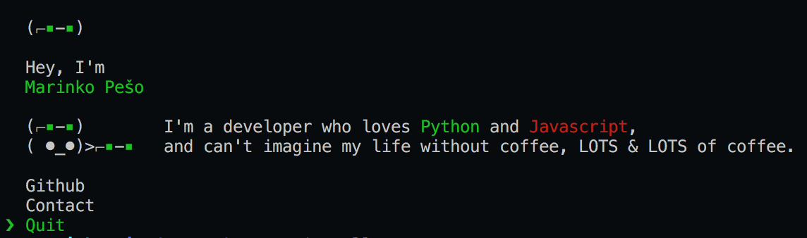

# [](https://github.com/ellerbrock/open-source-badges/) [](https://npm.im/marinko-peso) [](https://github.com/marinko-peso/marinko-peso/blob/master/LICENSE)

> marinko-peso's CLI



## Usage

Install Node.js, then:

```
$ npx marinko-peso
```

## Acknowledgments

Inspired by @sindresorhus's awesome [CLI](https://github.com/sindresorhus/sindresorhus) and forked from even more awesome [vladimyr](https://github.com/vladimyr/vladimyr)
